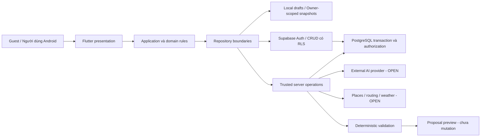

# 06 — Kiến trúc hệ thống và tích hợp API

> Phiên bản thiết kế: 1.0 • Ngày lập: 2026-10-08 • Deadline: **2026-10-28**.
> Trạng thái: **APPROVED WITH CONDITIONS — DESIGN WORK AUTHORIZED, IMPLEMENTATION NOT AUTHORIZED**.
> Baseline: S-MP (Master Prompt v1.0); đặc tả chưa chứng minh tính năng đã triển khai hoặc Phase 1 đã đóng.

## Baseline và hiện trạng

[CONFIRMED] Flutter/Dart, Android-first, Supabase, PostgreSQL, Hybrid AI, Windows, free-tier preference; offline Guest draft + read-only saved itinerary (S-MP §8.1). [PROPOSED] Thiết kế bên dưới là target logical architecture, không là migration hoặc thay thế code hiện hữu.

[OPEN] S-REPO có Flutter feature folders, backend/, Provider, Dio, fl_chart, supabase_flutter, flutter_map và weather service. Chưa xác minh runtime, schema deployed, permissions, keys hoặc coverage. ADR trong .agent/knowledge.md là quyết định ngữ cảnh cũ, không tự giải quyết OQ của baseline mới. CF-003/OQ-011 cần quyết định vai trò engine/LLM trước Phase 2.

## System context [PROPOSED]

[PROPOSED] Client không giữ secrets của AI/third-party server. Supabase publishable/anon key là định danh public project nếu được thiết kế cho client và bảo vệ bằng grants/RLS; khác với service_role/secret key. Nhận định README cũ “API Key có trong code” chưa đủ để kết luận an toàn hay lộ secret. [Tham khảo RLS chính thức](https://supabase.com/docs/guides/database/postgres/row-level-security).

## Logical components và lý do tồn tại [PROPOSED]

| Thành phần | Trách nhiệm | Boundary và lý do |
| --- | --- | --- |
| Presentation per feature | Screens, timeline, budget, preview, loading/error/empty | Không đọc secret, không tự quyết quyền remote |
| Application use cases | Create draft, request AI, preview, confirm, migrate, save, load snapshot | Phối hợp domain và repository; tách saved khỏi draft |
| Domain rules | Dates/items, money/categories, proposal state, data quality | Cùng itinerary model manual/AI; unit-testable |
| Repository contracts | Auth, catalogue, trip, expense, AI, local | Phân biệt local/remote; không cần interface cho mọi widget |
| Supabase Auth + CRUD | Identity, profile own, catalogue public, private reads | Backend grants/RLS enforce mọi nested row |
| Trusted operations | Atomic itinerary write, AI request/apply, draft import, sensitive member actions | Không thể an toàn chỉ bằng client check nhiều requests |
| Provider adapters | Normalize AI/places/weather/routing output + metadata | Thay provider sau quyết định, không khóa core vào payload nhà cung cấp |
| Local persistence | Draft restart recovery, saved immutable snapshot | Không phát triển offline conflict sync engine |
| Extension boundary | Group/Community, Booking tương lai | Chỉ conceptual; không provision bảng/queue/service cho deferred |

[PROPOSED] Client validation giúp feedback; backend validation và database constraints là authority cho remote writes. Không sao chép MCDA/Pareto/Greedy engine hiện có vào UI; server giữ vai trò quyết định nếu được xác nhận ở OQ-011. Local cost sums/timeline editing là thao tác nhẹ theo S-MP §10, không thay engine ranking.

## ADR register

| ID | Trạng thái; nguồn | Quyết định/ứng viên | Phương án khác và trade-off |
| --- | --- | --- | --- |
| ADR-P1-001 | [CONFIRMED]; S-MP §8.1 | Flutter/Dart, Android, Supabase/PostgreSQL | Không thay bằng backend/platform mới trong tác vụ này |
| ADR-P1-002 | [PROPOSED]; §8.2 | Feature-based presentation/application/data, repository pattern vừa đủ | Layer-first dễ khởi đầu nhưng khó tìm feature; deep Clean Architecture tăng ceremony không cần thiết |
| ADR-P1-003 | [PROPOSED]; §5.4; CF-003 | External model tạo candidate; structured data và deterministic server checks; engine hiện có qua adapter nếu được duyệt | LLM tự quyết toàn bộ thiếu tin cậy; chỉ LLM explainer không đủ generation/chat/modification baseline |
| ADR-P1-004 | [PROPOSED]; §8.3 | Supabase Edge Functions làm sensitive orchestration; atomic DB operation cho version/apply/import | Backend đang có giữ lại và adapter cũng là ứng viên; không thêm deployment thứ hai trước OQ-001/011 |
| ADR-P1-005 | [PROPOSED]; OQ-007 | Ưu tiên đánh giá Provider đang có; so sánh Riverpod/BLoC chỉ khi có lý do | Đổi framework tăng chi phí migration; hiện dùng Provider không đồng nghĩa OQ-007 đã đóng |
| ADR-P1-006 | [PROPOSED]; OQ-007 | SQLite phù hợp dữ liệu day/items/expenses và atomic draft/snapshot; evaluate wrapper | Key-value nhẹ hơn nhưng khó transaction/relationship; chọn package cần duyệt, không cài đặt lúc này |
| ADR-P1-007 | [PROPOSED]; BR-005/018 | Separate immutable AI proposal, base_version, preview digest, atomic apply | In-place AI mutate có thể mất confirmed itinerary; auto-merge tăng độ phức tạp |
| ADR-P1-008 | [OPEN]; OQ-002 | Gemini là candidate theo prompt, không phải provider cuối | So provider theo Vietnamese/structured output/privacy/cost/account availability, không chốt model ID |
| ADR-P1-009 | [OPEN]; OQ-008/012 | Map/weather provider chờ PoC và điều kiện | Dependency hiện có chỉ là evidence; không tự gọi đó là lựa chọn được duyệt |

## Hybrid AI pipeline và state [PROPOSED]

1. Gateway kiểm tra session hoặc Guest token, quota, input size và trip access khi có trip ID.
2. Server lấy structured catalogue; normalize provenance từng price/hours/coords/travel/weather field. Chỉ gửi phần preferences/trip tối thiểu, không gửi email, password, token hoặc toàn bộ private profile.
3. Provider tạo candidate qua contract logic: schema_version, request_id, days/items, references, estimates, rationale và warnings. Đây là contract ứng dụng đề xuất, không endpoint provider được bịa ra.
4. Validator kiểm tra schema/type/range, dates/day membership, item identity/reference, overlaps/travel feasibility khi có dữ liệu, known opening hours, budget/sở thích. Ngoài budget là warning theo BR-008.
5. Invalid hard constraints → rejected output và lỗi có thể hành động; missing fields → unknown + warnings. LLM không được nâng giá trị nó tự tạo thành verified. Estimate phải ghi nguồn hoặc giả định ước tính; trường không đủ căn cứ để ước tính giữ unknown/null.
6. Response là proposal riêng, không saved itinerary. UI preview changes và quality warnings; người dùng chỉnh/reject/confirm.
7. Apply qua authorized transaction: subject/trip/proposal/digest/base_version khớp, validate lại quyền/rules, itinerary+estimate/version+receipt cùng commit. Actual expense không bị mutation theo AI. Result timeout → tra receipt, không regenerate rồi auto-save.

State: received → processing → proposed hoặc failed → applied/rejected/expired. “proposed” không nghĩa user confirmed. Hủy request phía UI không bảo đảm provider đã dừng; response muộn không tự apply. Guest proposal giữ local theo policy, không ghi vào private-trip tables.

### Provenance contract [PROPOSED]

Mỗi trường external có value nullable, unit, quality (verified/estimated/unknown), source/provider/reference, retrieved_at, verified_at nếu thực sự có kiểm chứng, valid_for/forecast_time khi phù hợp. “Có nguồn API” không bằng mọi giá trị đã được xác minh thực địa. Giá/giờ stale được hạ mức sử dụng và cảnh báo theo OQ-003/015. Sample/fixture luôn labeled sample. Không dùng null thành zero hay “mở cửa”.

## A/B/C API classification và Integration Matrix

Mọi operation name/API-A/B dưới đây là **[PROPOSED] specification-level contract**, chưa là deployed endpoint. LOCAL-* là local operation, không là API remote. Provider chưa chọn giữ **[OPEN]**. Không gán quota/giá cố định khi chưa đo tài khoản thật.

| ID / Loại / MVP | Purpose + FR | Inputs | Expected outputs | Auth / secret management | Free-tier / freshness | Failure + fallback |
| --- | --- | --- | --- | --- | --- | --- |
| API-A-01 / A / MUST | Auth email, Google, session; FR-ACC-002/003 | Credentials hoặc OAuth flow, refresh context | Subject, session hoặc auth error | Supabase Auth [PROPOSED]; token protected local, không log password | Xác minh cấu hình Google/email và quota tài khoản; session expiry server | Cancel/network/login error giữ draft, reauth rõ |
| API-A-02 / A / MUST | Catalogue search/detail/sample; FR-DIS-* | Query, interests, destination/page | Published destinations/places/sample + provenance | Public read theo grants/RLS, curated writes server/admin | Internal cached, source timestamps; quota theo Supabase plan | Cache labeled hoặc empty/error; không fake |
| API-A-03 / A / MUST | Profile; FR-ACC-004 | Own subject + fields | Validated profile/version | JWT subject; RLS own; publishable client key khác secret | Session/current profile; plan xác minh | Keep unsaved form, retry, không đổi trip ngầm |
| API-A-04 / A / MUST | Save/import/read trips; FR-ACC-006, FR-TRP-004/005 | Trip model, draft key/revision, expected_version | Private trip/version/receipt | JWT; RLS read; trusted atomic mutation; server secret only | Supabase plan; authoritative commit/version | Conflict/unauthorized/error; local giữ draft; retry idempotent |
| API-A-05 / A / MUST | Expense CRUD và itinerary update; FR-BUD-* | Amount/kind/category/item link, request key/version | Ledger + totals + warnings | JWT + trip authorization; transaction; RLS nested | Timestamp/version; hạn mức chưa xác minh | Không double-charge entry; preserve actual, retry có receipt |
| API-A-06 / A / MUST | AI request/status/apply; FR-AI-* | Intent, constraints, minimum prefs; proposal/digest/base version khi apply | Proposal/warnings/status; applied receipt sau confirm | JWT hoặc scoped Guest token [PROPOSED]; AI secret server; quota trước external call | App quota OQ-005 khác provider quota; proposal tuổi OQ-015 | Invalid/quota/429/timeout giữ current itinerary, manual |
| API-A-07 / A / SHOULD | Group invitation/member/edit; FR-GRP-* | Trip, invitation subject, version | Membership/invite receipt hoặc conflict | JWT; Owner cho admin; Editor limited; token scoped | Invitation expiry OQ-014; không mặc định realtime | Reject stale/expired/removed user; reload preview |
| API-A-08 / A / SHOULD | Community publish/moderate; FR-COM-* | Content/rating/action/reason | Content state và audit metadata | Auth author/moderator backend roles; không client role claim | Content status authoritative; rate/storage quota cần kiểm chứng | Reject ownership; hidden content không public; retry form |
| API-B-01 / B / MUST | External AI generation/chat/recommendations; FR-AI-* | Sanitized structured context + constraints | Candidate normalized, không mutation trip | Gemini candidate [OPEN], alternative cần duyệt; secret server | Pricing/model/tier/privacy qua EXT-03/04; quota thực tài khoản chưa biết | Timeout/429/model/schema error → manual và explicit retry |
| API-B-02 / B / SHOULD, hỗ trợ catalogue khi cần | Places/location; FR-DIS-002, FR-MAP-001 | Destination/coordinates/provider reference | Place info/hours/coords + source/status | Google Places hoặc nguồn OSM thích hợp [OPEN]; secret gateway; public data rights | Billing/attribution/cache policy và coverage Việt Nam cần kiểm; không assume complete | Curated internal; hours/price unknown nếu không có nguồn |
| API-B-03 / B / SHOULD | Map tiles, routing, distance/time; FR-MAP-001, FR-AI-005 | Coordinates, travel mode, departure context | Map/pins, route geometry/distance/duration + timestamp | Google Maps/Routes hoặc OSM tile host + routing service [OPEN]; restricted public map key nếu cần, sensitive routing key server | EXT-05/06; route estimates không live verified; routing không do tiles cung cấp | Itinerary list; estimate labeled hoặc unknown; không route giả |
| API-B-04 / B / SHOULD | Weather forecast/gợi ý/cảnh báo; FR-WEA-001 | Destination coords, travel date/timezone | Forecast timestamp/horizon/units/source | Open-Meteo candidate [OPEN]; auth theo plan, secret server nếu có | EXT-07, noncommercial eligibility/attribution và forecast horizon cần kiểm | Stale/absent/outside horizon → unknown, không block planner |
| LOCAL-01 / C / MUST | Input/timeline editing/sample copy | Local draft/day/items | Editable model + validation | Device data boundary, không API key | Không external quota; local draft revision | Validation/storage lỗi giữ form |
| LOCAL-02 / C / MUST | Draft/snapshot persistence | Owner scope + model/schema/version | Restart-safe draft/read-only snapshot | Owner partition; session/cache policy | No external quota; fetched_at trên cache | Incomplete write không replace valid snapshot |
| LOCAL-03 / C / MUST | Cost totals/local rule checks | Budget + known active estimates + actual ledger | Hai balances + unknown count + warnings | Local, revalidate remote khi save | Không external API cho phép cộng; fixed precision | Unknown không zero verified; actual giữ độc lập |

### Contract và lỗi dùng chung [PROPOSED]

Request mutation có request_id/idempotency_key và expected_version nếu sửa aggregate. Response thành công trả identity, version, committed_at và receipt. Validation error có field/reason; unauthenticated/forbidden không tiết lộ nội dung trip; conflict trả version metadata chỉ cho người còn quyền; quota/temporarily_unavailable có hướng manual/retry; provider_error không lộ payload/secret.

Dùng HTTP semantics tương ứng khi API shape được chọn ở OQ-001; không khẳng định URL nào đang chạy. CRUD profile/read catalogue/private read có thể qua Supabase client + grants/RLS. Apply AI/import/versioned multi-row writes/member admin cần trusted server/database transaction; không dùng nhiều CRUD client như một transaction giả.

## Provider evaluation dựa trên tài liệu chính thức

Ngày tham khảo: **2026-10-08**. Đây là đánh giá điều kiện, chưa duyệt provider, quota, giá hoặc provisioning.

| Nguồn | Điều đã kiểm tra | Điều chưa kiểm chứng / quyết định |
| --- | --- | --- |
| EXT-01 [Supabase RLS](https://supabase.com/docs/guides/database/postgres/row-level-security) | Quyền theo row cần policies và grants; service role có khả năng bypass RLS | Policies deployed của repo chưa audit; phải negative-test |
| EXT-02 [Supabase server secrets](https://supabase.com/docs/guides/functions/secrets) và [pricing](https://supabase.com/pricing) | Secrets server-side; plan có giới hạn | Entitlement/quota thực, hoạt động project và deployment chưa xác minh |
| EXT-03 [Gemini rate limits](https://ai.google.dev/gemini-api/docs/rate-limits) | Hạn mức phụ thuộc model/tier/project, không chỉ từng key | Chưa đăng nhập AI Studio để biết quota/account; app Guest quota là quyết định riêng |
| EXT-04 [Gemini pricing](https://ai.google.dev/gemini-api/docs/pricing) | Free/paid khác theo model và điều kiện xử lý dữ liệu | Không chốt model/giá; review privacy trước gửi private preferences |
| EXT-05 [Google Maps pricing](https://developers.google.com/maps/billing-and-pricing/overview) | Billing theo SKU/event; maps, routes, places khác nhau | Xác minh billing setup, key restriction, coverage, cost cap và SDK trên Android |
| EXT-06 [OSMF Tile Usage Policy](https://operations.osmfoundation.org/policies/tiles/) | Standard tile host cần attribution, caching và nhận diện app; không cho offline bulk download | OSM data không đồng nghĩa tile/routing host miễn phí không giới hạn; chọn host/routing riêng |
| EXT-07 [Open-Meteo terms](https://open-meteo.com/en/terms) | Free service theo noncommercial terms, usage limits và attribution | Chưa xác nhận project đủ điều kiện; forecast không cam kết availability toàn thời gian |
| EXT-08 [openrouteservice plans](https://account.heigit.org/info/plans) | Trang kế hoạch ứng viên đã được truy cập nhưng không trả nội dung đọc được | Không suy diễn quota hoặc eligibility; giữ OPEN để xác minh chính thức trong PoC |

[PROPOSED] PoC sau approval phải chứng minh: gọi thật từ Android/server, địa điểm Việt Nam, lỗi/quota handling, attribution/restrictions, latency thực, secrets không xuất hiện trong bundle/log, ghi rõ tài khoản/plan/date và chi phí phát sinh nếu có. Map provider chỉ duyệt sau PoC theo S-MP §6.1. Không tạo key/accounts hoặc chạy PoC implementation trong Phase 1.

## Extension và giới hạn

[DEFERRED] Booking qua provider adapter tương lai chỉ mô tả boundary itinerary-place reference; không tables reservation/payment, webhook, message broker. Notifications không có push token/queue hiện tại. [PROPOSED] Community/Group conceptual model giữ ngoài core deployment khi SHOULD chưa chọn. Không yêu cầu migrate hoặc sửa code nào từ tài liệu này.

---
[Xem mục lục và quy ước nguồn/trạng thái](README.md).
