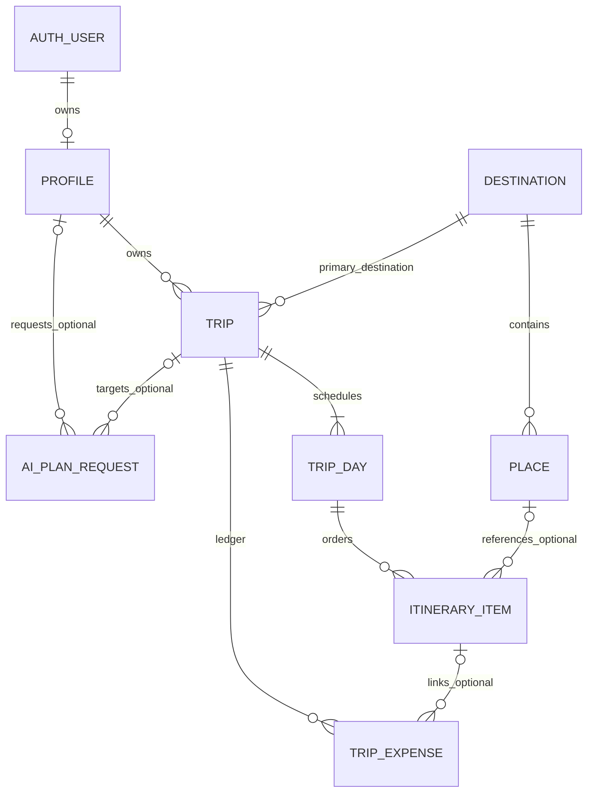

# 07 — Database design và ERD specification

> Phiên bản thiết kế: 1.0 • Ngày lập: 2026-10-08 • Deadline: **2026-10-28**.
> Trạng thái: **APPROVED WITH CONDITIONS — DESIGN WORK AUTHORIZED, IMPLEMENTATION NOT AUTHORIZED**.
> Baseline: S-MP (Master Prompt v1.0); đặc tả chưa chứng minh tính năng đã triển khai hoặc Phase 1 đã đóng.

## Phạm vi và quyết định mô hình

[CONFIRMED] PostgreSQL qua Supabase; cần ownership, referential integrity, version, expense separation và backend authorization (S-MP §8–9; BR-007/009/018/021). **Toàn bộ tên entity, field, kiểu, constraint, index và transaction dưới đây là [PROPOSED]** logical schema; không SQL, không migration, không giả định deployed schema giống thiết kế.

DB-001 [PROPOSED]: Core chỉ profiles, destinations, places, trips, trip_days, itinerary_items, trip_expenses, ai_plan_requests và catalogue sample trong dữ liệu curated. Group/Community chỉ mô hình conceptual mở rộng. GuestAIRequest tạm theo quota policy server, không tạo Guest user profile giả để vượt ownership.

## Conceptual ERD [PROPOSED]

DB-002 [PROPOSED]: persisted trip aggregate có ít nhất một day đúng date range khi confirm/save; bản draft local có thể chưa đủ ngày. AI request cho recommendation/Guest có thể chưa có trip/profile. Public sample catalogue không là private trip của một tài khoản giả.

## Logical entities và field dictionary [PROPOSED]

Ký hiệu ! = required; ? = optional/null. UUID là định danh đề xuất, không gắn vào provider ID. Amount numeric fixed precision; datetime lưu UTC với trip timezone riêng; ngày đi là calendar date không tự đổi khi UTC conversion.

| Entity / PK | Fields chính và required/optional | FK / cardinality | Ownership / constraints |
| --- | --- | --- | --- |
| profiles / user_id! | display_name?, interests! (có thể rỗng), typical_budget?, travel_style?, created_at!, updated_at! | user_id → Auth subject, 1:0..1 | Own user; budget nonnegative nếu có; email/password không sao chép sang profile |
| destinations / id! | name!, region!, country_code!, description?, interests!, publication_status!, source_reference?, retrieved_at?, verified_at?, quality!, sample_itineraries? | Destination 1:0..N place, 1:0..N trip | Public read chỉ published; curate/admin write; source/status theo từng field khi khác nhau |
| places / id! | destination_id!, name!, description?, latitude?, longitude?, opening_hours?, cost_reference?, provider_name?, external_id?, provenance!, updated_at! | destination_id → destinations; 1:0..N item | Tọa độ theo cặp và range; opening_hours unknown nullable; provider+external_id unique khi cả hai có |
| trips / id! | owner_id!, destination_id!, start_date!, end_date!, total_budget!, traveler_count!, interests!, start_location!, travel_style?, timezone!, currency!, status!, visibility!, itinerary_version!, source_draft_id?, source_revision?, created_at!, updated_at! | owner_id → profiles; destination_id → destinations; 1:1..N day | Owner bất biến ở MVP; private mặc định; date/count/budget constraint BR-P002; version integer ≥1 |
| trip_days / id! | trip_id!, date!, ordinal!, notes? | trip_id → trips; 1:0..N item | Unique trip_id+date và trip_id+ordinal; date thuộc range trip |
| itinerary_items / id! | trip_id!, trip_day_id!, place_id?, title!, start_time?, end_time?, position!, travel_mode?, travel_duration?, duration_quality!, location_snapshot?, opening_hours_snapshot?, provenance!, user_exception_reason? | trip_day_id → day cùng trip; place_id → places optional | Unique day+position; custom item không cần place_id; không cho day thuộc trip khác |
| trip_expenses / id! | trip_id!, item_id?, kind!, amount?, category!, basis!, quantity!, description?, paid_at?, origin!, active!, source_item_snapshot?, provenance!, created_by!, request_key!, created_at!, updated_at! | trip_id → trips; item_id → item cùng trip optional; created_by → Auth subject | kind estimated/actual; actual amount required ≥0; unknown estimated amount null; quantity dương; unique trip+request_key |
| ai_plan_requests / id! | requester_id?, trip_id?, guest_subject_hash?, intent!, request_key!, base_version?, input_digest!, proposal_digest?, proposal_payload?, quality_warnings!, state!, provider_reference?, created_at!, expires_at?, applied_at?, result_receipt? | requester_id → profiles optional; trip_id → trips optional | Exactly one requester hoặc Guest subject; proposal private; unique subject+request_key; applied receipt giữ idempotency |

DB-003 [PROPOSED]: provenance trong logical model có thể là cấu trúc embedded, chưa ép thêm bảng; không lưu raw prompt chứa PII hoặc raw provider payload vô thời hạn. Với mỗi field cần value, unit, quality, source reference và thời gian; cross-reference API contract [06](ARCHITECTURE.md). Opening hours cần timezone và ngoại lệ nếu nguồn cung cấp; không đánh đồng chuỗi LLM sinh với giờ verified.

DB-004 [PROPOSED]: SourceDraft identity unique owner_id+source_draft_id+source_revision để retry không tạo thêm trip cùng revision. Policy revision mới update/copy vẫn OQ-009; không tự coi mọi draft giống nội dung là duplicate. Transaction receipt gắn key với output trip/version; xác nhận save không phụ thuộc client timestamp.

## Local và curated models [PROPOSED]

| Model | Dữ liệu cần giữ | Hành vi |
| --- | --- | --- |
| LocalDraft | draft UUID, device scope, revision, trip input/day/items/estimates/local actual entries, quality, saved_at, migration state/receipt | Writable local cho Guest; restart recovery; migration có chọn chủ đích; version khác remote itinerary_version |
| OfflineSnapshot | authenticated owner ID, trip ID, itinerary version, schema version, fetched_at, trip/day/items và budget display snapshot | Immutable read-only; atomic replace; partition owner; không cache secret/session plaintext |
| SampleItinerary | stable sample ID/version, destination ID, day/activity template, known estimates, source/license/status | Curated structured catalogue, copy thành LocalDraft; sample không là live AI |
| GuestAIRequest | scoped Guest subject hash, intent, quota counters/window, request key/state và proposal tạm | Server-owned ephemeral design; anonymous không đọc private trip; retention/quota OQ-005/015 |
| WeatherSnapshot | destination coords, provider/reference, forecast/valid times, retrieved_at, units/status | Snapshot context có freshness; chưa đề xuất core weather table |

DB-005 [PROPOSED]: Local migrated drafts chứa dữ liệu đã nhận bởi account cần chuyển owner scope; không để ở Guest vùng public thiết bị. Sign-out/cache deletion không cần xóa draft chưa chuyển của Guest. Giới hạn thiết bị dùng chung cần consent/policy ở OQ-015.

## Referential integrity, transaction và indexes [PROPOSED]

- Save/import: trip, days, items, expenses và receipt commit cùng nhau. Không có half-saved itinerary. Request key retry cùng payload trả receipt; key cùng khác payload bị reject.
- Day/date liên kết trip bằng constraint/transaction validation; item có trip_id redundant để RLS/lookup nhưng bắt buộc khớp day.trip_id. Expense item link cũng khớp trip. Không chỉ tin UUID từ client.
- Reorder dùng aggregate transaction đảm bảo position unique cuối transaction. Date range resize yêu cầu preview các days/items ảnh hưởng, không silently delete actual.
- Itinerary mutation so sánh expected_version nguyên tử rồi tăng +1; AI apply và manual update dùng cùng quy tắc. Đồng thời validate quyền hiện tại, trạng thái proposal/digest.
- Delete itinerary item: inactive/remove derived estimated entries theo BR-P009; actual item link → null và giữ item snapshot. Không cascade actual theo item deletion.
- Delete trip do Owner: cascade aggregate days/items/expenses/request data thuộc trip; catalog nguồn không xóa. Profile deletion/anonymization, account/trip retention cần OQ-015 trước destructive implementation.
- Catalogue place bị unpublish không làm saved itinerary mất title/location snapshot. Không xóa destination còn trip tham chiếu tùy tiện; archive catalogue trước, policy hard-delete cần duyệt.
- Index candidates: trips(owner_id, updated_at), days(trip_id,date), items(trip_id,trip_day_id,position), expenses(trip_id,kind,active), AI(subject,request_key), provider reference unique. Chưa thêm partitioning/sharding.

## Access/RLS specification [PROPOSED]

DB-006: bật grants tối thiểu và RLS trên mọi bảng expose; deny mặc định. Auth UID từ verified session; không trust owner_id/requester_id client. Policies cho SELECT/INSERT/UPDATE/DELETE tách rõ, write kiểm tra trạng thái row sau update để ngăn đổi owner/trip.

| Dữ liệu | Read | Write |
| --- | --- | --- |
| profiles | Chỉ own; không public private preferences | Chỉ own permitted columns |
| destinations/places/sample | Guest/user chỉ published | Server curator; không cho user update source/status |
| trips | Owner; active member nếu Group triển khai | Owner/edit membership theo operation; owner/visibility/version không để generic client tự thay |
| days/items/expenses | Có quyền đọc trip parent | Có quyền edit trip và parent consistency; atomic remote writes qua trusted operation |
| ai_plan_requests | Own request và còn quyền trip nếu target trip; không expose raw sensitive input | Gateway/server state machine; client không đổi state thành applied |
| Guest AI transient | Không direct database read cho anon | Gateway scoped token/quota; chưa policy quota cuối |

DB-007: trusted operation dùng token scope thấp nhất có thể. Nếu dùng elevated server key, phải tự kiểm tra subject + trip membership + allowed operation trước query; service role bypass RLS không thay thế authorization. Database and server negative tests là AC-034/041/046.

## SHOULD conceptual extensions — chưa deploy [PROPOSED]

| Entity | Keys/fields/relationships | Constraints/access |
| --- | --- | --- |
| trip_members | trip_id + user_id PK; role Editor, state, joined_at | Unique member; trip 1:N members; Owner lấy từ trips.owner_id, không tạo Owner thứ hai; active member read/edit |
| TripInvitation | id PK; trip_id/issuer_id/target subject; token hash; state; expires_at | Owner issuer; single-use, expiry, revoke; token không public; OQ-014 |
| posts | id PK; author_id FK; title/body; publication/moderation_state; reason/time | Public published only; author write, moderator hide; không link private trip data tự động |
| reviews | id PK; author_id/place_id FK; rating/body/status | Rating scale [OPEN OQ-013]; một review per user/place [PROPOSED] |
| comments | id PK; author_id, content, post_id? hoặc review_id? | Exactly one parent; parent visible; author own; moderator quyền giới hạn |
| likes | user_id + target ID composite identity | Exactly one post/review target; unique để retry không double-like |

[DEFERRED] Không reservation/payment/notification entities. Storage community media chỉ đánh giá khi Community chọn; private buckets và ownership nếu dùng, không provision sẵn.

## Retention, deletion và scale

[PROPOSED] AI logs tối thiểu redacted; proposal có expiry; snapshot thể hiện fetched_at; catalog provenance giữ lịch sử đủ kiểm chứng. [OPEN] OQ-015 xác định TTL cache/AI logs/proposal, account deletion và audit retention; không invent thời hạn pháp lý.

[PROPOSED] Pagination catalogue/trips, indexes theo access path, limit request/output đã duyệt và lean dataset phù hợp học thuật. Nếu dữ liệu tăng, đo trước thêm full-text search/geo indexing; không dựng hạ tầng vượt MVP.

---
[Xem mục lục và quy ước nguồn/trạng thái](README.md).
